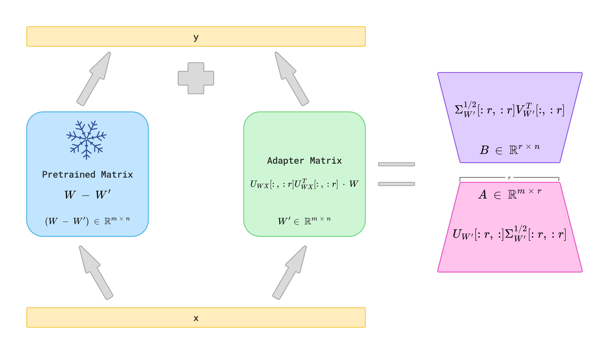

# AdaptorsResearch

В данной работе предоставлена более устойчивая реализация методов низкоранговой инициалзации. А также, предоставлена реализация метода CoTAn и использование его для дообучения LLaMA.



## Generation dataset

Первое, что вам нужно сделать после клонирования репозитория, это скачать (локально) все датасеты:

```bash
./generators/common_reasoning-gen.sh
./generators/8_datasets-gen.sh
```

```bash
./generators/samples_reasoning-generator.sh {count_examples on each dataset}
```

## Training

```bash
./scripts/train_llama3_1b.sh ./name_dir_where_safe ./scripts/{name_of_initialization}_config.yaml
```

Возможно вы захотите добавить CUDA_VISIBLE_DEVICES=1 чтобы обучение было на одной конкретной gpu.

## Validation

```bash
./scripts/valid_llama3_1b.sh ./name_dir_where_safe/ft/ ./scripts/{name_of_initialization}_config.yaml {name_dataset} ./output_dir
```

name_dataset нужно выбраз из: "common-reasoning", "BoolQ", "PIQA", "SIQA", "hellaswag", "winogrande", "ARC-E", "ARC-C", "OBQA"


## Get information about initialization

```bash
./scripts/calc_llama3_1b.sh ./path_so_save/file.pkl ./scripts/{name_of_initialization}_config.yaml 
```

